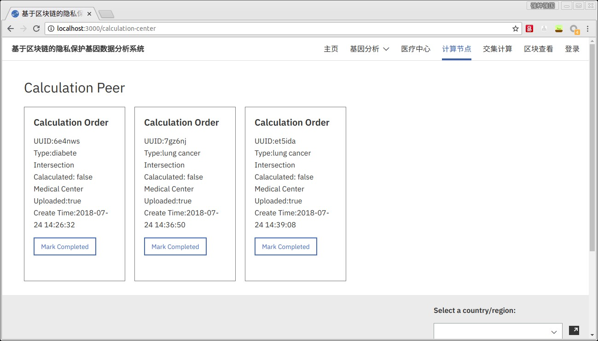
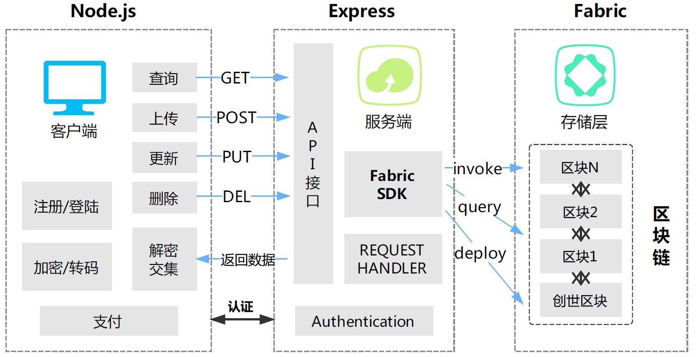
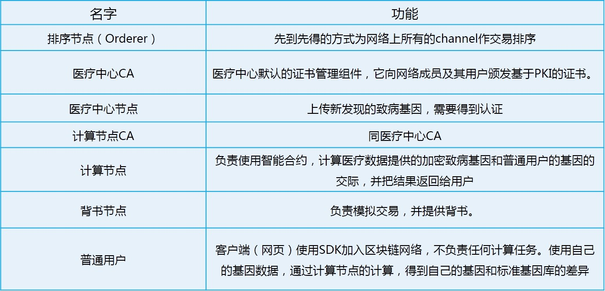
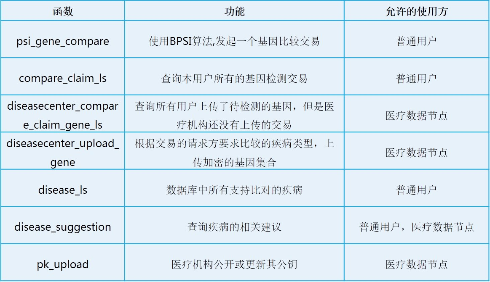
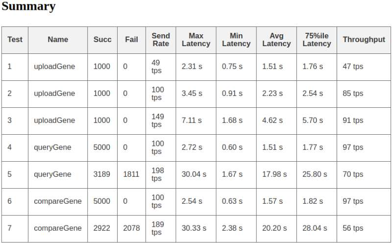
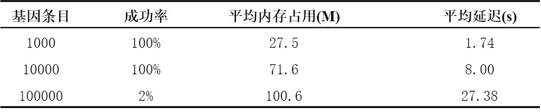
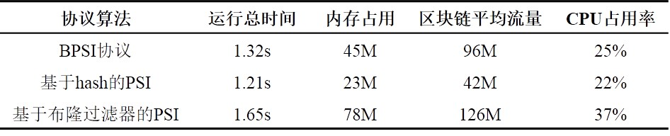
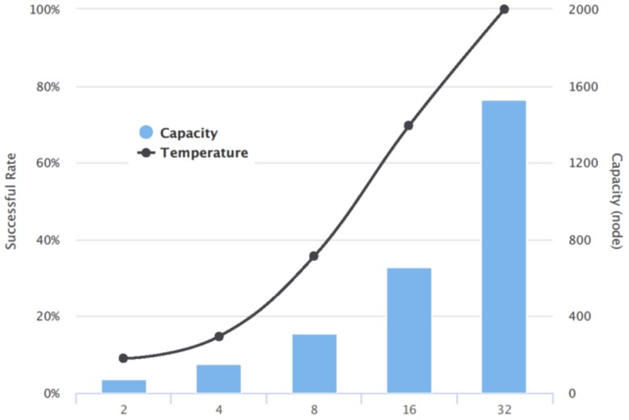

# 基于区块链的隐私保护基因分析系统

## 系统功能
- 用户上传比较基因
- 医疗检测机构上传致病基因
- 计算节点提供算力，计算基因交集
- 用户查询结果
- 区块链查询/可视化

## 系统架构

### 区块链网络结构

### 智能合约实现

## 性能测试
  本系统使用Cipher 框架进行区块链的压力测试，测试了不不同维度下的的区块链的承压能力
 

### 上传致病基因数据

### 隐私保护机制协议

### TODO
- 智能合约检查发起方的ORG
